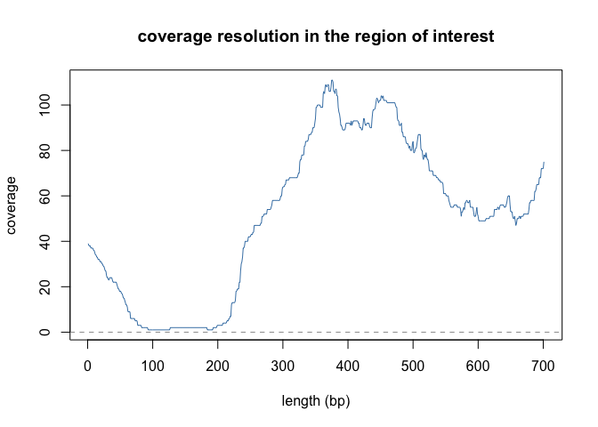
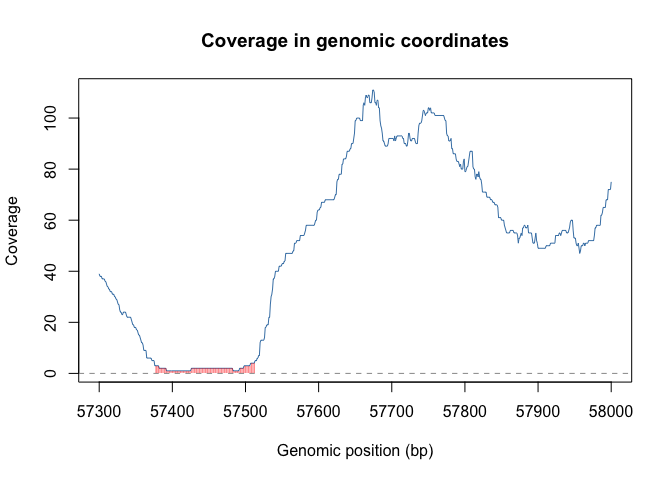
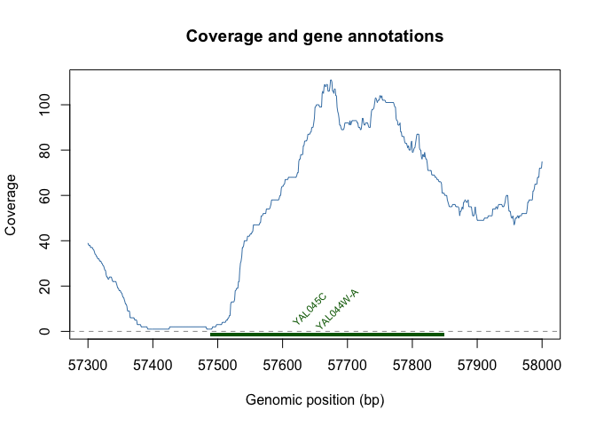

The *read coverage* is the number of reads that cover a given genomic position. 
Computing the read coverage generally consists in computing the coverage at each 
position in the genome.


```r
library(GenomicAlignments)
library(dplyr)
```


Read a .bam (Binary Alignment/Map) file, which stores aligned sequencing reads against a reference genome. 

```r
x <- readGAlignments("data/SRR9336468.bam")
```

Look at the object

```r
class(x)
```

```
## [1] "GAlignments"
## attr(,"package")
## [1] "GenomicAlignments"
```

```r
x
```

```
## GAlignments object with 1895023 alignments and 0 metadata columns:
##             seqnames strand                 cigar    qwidth     start       end
##                <Rle>  <Rle>           <character> <integer> <integer> <integer>
##         [1]        I      + 14M2D3M1D4M1I45M1I82M       150        69       219
##         [2]        I      -                  150M       150       140       289
##         [3]        I      +             128M1D22M       150       181       331
##         [4]        I      +              90M1D60M       150       219       369
##         [5]        I      -          66M1D78M1D6M       150       243       394
##         ...      ...    ...                   ...       ...       ...       ...
##   [1895019]     Mito      +                  150M       150     43327     43476
##   [1895020]     Mito      -                  150M       150     43439     43588
##   [1895021]     Mito      +              83M1D67M       150     58251     58401
##   [1895022]     Mito      -              5M1D145M       150     58329     58479
##   [1895023]     Mito      -              6M3I141M       150     61861     62007
##                 width     njunc
##             <integer> <integer>
##         [1]       151         0
##         [2]       150         0
##         [3]       151         0
##         [4]       151         0
##         [5]       152         0
##         ...       ...       ...
##   [1895019]       150         0
##   [1895020]       150         0
##   [1895021]       151         0
##   [1895022]       151         0
##   [1895023]       147         0
##   -------
##   seqinfo: 17 sequences from an unspecified genome
```


Extract the coverage.

```r
xcov <- coverage(x)
head(xcov)
```

```
## RleList of length 6
## $I
## integer-Rle of length 230218 with 21075 runs
##   Lengths:    68    71    41    38     1 ...   428   114    36   114  1076
##   Values :     0     1     2     3     4 ...     0     1     2     1     0
## 
## $II
## integer-Rle of length 813184 with 108485 runs
##   Lengths:  210    1   37    5    2    5    4 ...   26    4    1    4    1 1715
##   Values :    0    1    3    4    5    7   10 ...    9    8    7    6    4    0
## 
## $III
## integer-Rle of length 316620 with 34632 runs
##   Lengths: 5687   55   30   16   49   55   30 ...   14   74   32   30  120 9268
##   Values :    0    1    2    3    4    3    2 ...    3    2    1    2    1    0
## 
## $IV
## integer-Rle of length 1531933 with 190708 runs
##   Lengths:  267  148 1167   89   61   74    4 ...    2    2    2    1   51  147
##   Values :    0    1    0    1    2    1    2 ...    6    5    4    3    1    0
## 
## $V
## integer-Rle of length 576874 with 73885 runs
##   Lengths: 223  78   7   7   6   2   8   9 ...   2  14   3  18  14   2   3 269
##   Values :   0   1   4   6   7   8  10  11 ...  10   7   6   5   4   3   2   0
## 
## ...
## <1 more element>
```

Confirm the chromosome names 

```r
seqlevels(x)
```

```
##  [1] "I"    "II"   "III"  "IV"   "V"    "VI"   "VII"  "VIII" "IX"   "X"   
## [11] "XI"   "XII"  "XIII" "XIV"  "XV"   "XVI"  "Mito"
```


It is possible to examine the data for a specific chromosome, for example, chr. III. The first 5,687 base pairs exhibit zero coverage; the subsequent 55 base pairs show a coverage of 1 read, and so forth.


```r
xcov$III
```

```
## integer-Rle of length 316620 with 34632 runs
##   Lengths: 5687   55   30   16   49   55   30 ...   14   74   32   30  120 9268
##   Values :    0    1    2    3    4    3    2 ...    3    2    1    2    1    0
```

Average and max coverage:

```r
mean(xcov$III)
```

```
## [1] 22.91674
```

```r
max(xcov$III)
```

```
## [1] 1759
```

Next, we will obtain the coverage for a region of interest, for example, the genomic region in chr. I containing the gene YAL045C.


```r
z <- GRanges("I", IRanges(57300,58000)) #~genomic region for gene 'YAL045C'
xcov[z]
```

```
## RleList of length 1
## $I
## integer-Rle of length 701 with 242 runs
##   Lengths:  1  3  4  2  1  2  2  3  3  2  2 ...  8  1  2  6  2  1  4  3  4  1
##   Values : 39 38 37 36 35 34 33 32 31 30 29 ... 52 54 57 58 62 63 65 68 72 75
```

Plotting the coverage

```r
xnum <- as.numeric(xcov[z][[1]])

plot(xnum, col = "steelblue", main = "coverage resolution in the region of interest", 
     ylab = "coverage", 
     xlab = "length (bp)", 
     type = "l")

abline(h = 0, col = "gray60", lty = 2) # add base line -> coverage = 0
```

<!-- -->

```r
# Shade regions with low coverage (for example, coverage < 5)
# Show the actual coordinates 
start_pos <- start(z)
end_pos <- end(z)

plot(start_pos:end_pos, xnum, type = "l", col = "steelblue",
     main = "Coverage in genomic coordinates",
     ylab = "Coverage", xlab = "Genomic position (bp)")
abline(h = 0, col = "gray60", lty = 2)
low_cov <- which(xnum < 5)
rect(xleft = start_pos + low_cov - 1, 
     xright = start_pos + low_cov, 
     ybottom = 0, ytop = xnum[low_cov],
     col = rgb(1, 0, 0, 0.3), border = NA)
```

<!-- -->

```r
# We have lost the information only in :
int1 <- start(z)+100
int2 <- start(z)+200
```

We have lost the information only in the interval 57400-57500. We can verify using the GFF file whether any gene is annotated in that region.

```r
# Read gff file 
gff = read.delim("data/Saccharomyces_cerevisiae_genome.gff3", 
                 header=F, comment.char="#", 
                 col.names = c("seqname", "source", "feature", "start", "end", 
                               "score", "strand", "frame", "group"))
gff <- gff %>% as_tibble()

# Available genes in the specific genomic region 
genes_region <- gff %>% 
  filter(seqname == "I", feature == "gene", 
               start > 57300, end < 58000)

# Coverage Plot 
plot(57300:58000, xnum, type = "l", col = "steelblue",
     main = "Coverage and gene annotations",
     ylab = "Coverage", xlab = "Genomic position (bp)")

# Base line 
abline(h = 0, col = "gray60", lty = 2)

# overlap genes
if (nrow(genes_region) > 0) {
  for (i in 1:nrow(genes_region)) {
    rect(xleft = genes_region$start[i],
         xright = genes_region$end[i],
         ybottom = -2, ytop = -0.5,   # debajo del eje 0 para no solaparse con la cobertura
         col = "darkgreen", border = NA)
    
    # Label gene name (optional)
    gene_name <- sub(".*ID=gene:([^;]+);.*", "\\1", genes_region$group[i])
    text(x = (genes_region$start[i] + genes_region$end[i]) / 2,
         y = 10, labels = gene_name, cex = 0.7, col = "darkgreen", srt = 45)
  }
}
```

<!-- -->

```r
# Available genes in the specific genomic region where we do not have reads 
gff %>% 
  dplyr::filter(seqname == "I", feature == "gene", 
               start > int1, end < int2)
```

```
## # A tibble: 0 × 9
## # ℹ 9 variables: seqname <chr>, source <chr>, feature <chr>, start <int>,
## #   end <int>, score <chr>, strand <chr>, frame <chr>, group <chr>
```

You can obtain the counts (number of reads assigned to each gene) for all genes in your GFF file.

```r
# Filter genes
genes_gff <- subset(gff, feature == "gene")

# Extract gene names 
gene_names <- sub(".*ID=gene:([^;]+);.*", "\\1", genes_gff$group)

# Build GRanges
genes_gr <- GRanges(seqnames = genes_gff$seqname,
                    ranges = IRanges(start = genes_gff$start, end = genes_gff$end),
                    strand = genes_gff$strand,
                    gene_id = gene_names)

# Summarize overlaps 
se <- summarizeOverlaps(features = genes_gr, reads = x, mode = "Union",
                        singleEnd = TRUE, ignore.strand = TRUE)

# Extract the counts
counts <- assay(se)
length(counts) 
```

```
## [1] 6600
```

```r
rownames(counts ) = gene_names
head(counts)
```

```
##           reads
## YAL069W       4
## YAL068W-A     0
## YAL068C       0
## YAL067W-A     0
## YAL067C       0
## YAL066W       0
```

The per-gene counts are ready for expression analysis and normalization, for example using TPM/RPKM based on gene length.
